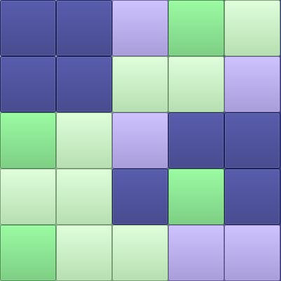
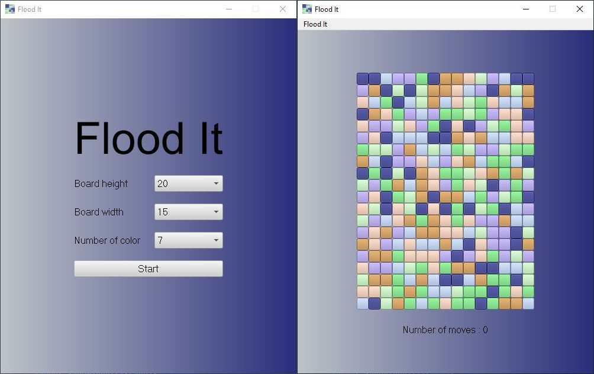

# Flood It 

## Table of content

***[Description](#description)***  
***[Project Structure](#project-structure)***  
***[Technologies](#technologies)***  
***[Setup](#setup)***  
***[Licensing](#licensing)***  

## Description

Flood-It is a game where colored pellets are placed on a rectangular board formed by rows of c columns of locations. Let l x c pads, because no place is left empty.  

There are k colors of pads. At a given time, a pellet is of a given color. Initially, the color of a pellet is determined randomly. During the course of the game, the color of the tablet changes. The object of the game is to obtain a monochrome board with a minimum number of game turns.  

Two locations are adjacent if they are either on the same row and on adjacent columns, or on the same column and on adjacent rows. The adjacency of the locations is therefore determined only laterally, not diagonally. In other words, adjacent locations touch each other at their edges, not at their corners.  

Because the board is rectangular, the number of adjacent locations at a given location ranges from two, for a location in a corner of the board, to four, exceeding three, for a location at the edge of the board but not at a corner.  
 
Two dots are adjacent if they occupy adjacent locations. The dots form zones. A zone is a maximum set of adjacent pellets of the same color. A zone is a maximum set of adjacent pellets of the same color. The term maximum means that all the pellets adjacent to a zone are of a different color than the color of the zone.  
 
Two zones are adjacent whenever one pellet in
one zone is adjacent to a pellet in the other. 

During the game, a zone has a special status, the captured pellet zone, or captured zone. Initially, the captured area contains a pellet located in a corner of the game board. When the board is displayed on a vertical screen, it is usual to take this pellet in its upper left corner. 

The game is divided into rounds. At the beginning of each round, the player always performs the same action: he selects one of the k colors, in order to extend the captured area. Let ki be the selected color. After selecting ki, the captured area takes this color. Since an area is by definition maximum, the ki-colored areas adjacent to the captured area merge with the latter, which ideally causes its extension.  This is followed by a new turn, or the end of the game if the captured area covers the entire board.

## Project Structure  

The project is divided into three main parts:
- **Core** which represents the model of the game in the form of a qt library written in standard C++ 17.
- **Console** to launch the game in console mode.
- **App** allowing to launch the game in graphic mode.

## Technologies

**Language**

- C++ version: 17

**Framework**

- Qt version: 5.15.0  

**Compiler**

- Desktop Qt MinGW 32-bit version: 5.15.0

## Setup

1. Install and launch Qt Creator
2. Clone the repo
3. Open the file Taquin.pro with Qt Creator
4. [Important] In Qt Creator, Right click on "core" folder -> Compile "Core"
5. In Qt Creator, Right click on "app" or "console" folder -> Execute

## Licensing

With confirmation from my laboratory supervisor I would like to post this project on my personal github with the license below (to be confirmed).

**Question: Can a real game under private license be licensed to copy-left in the "digital world"?**

This app is Licensed under the GNU General Public License v3.0. See [LICENSE](LICENSE) for the full license text.

